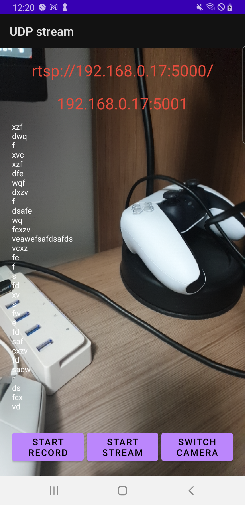
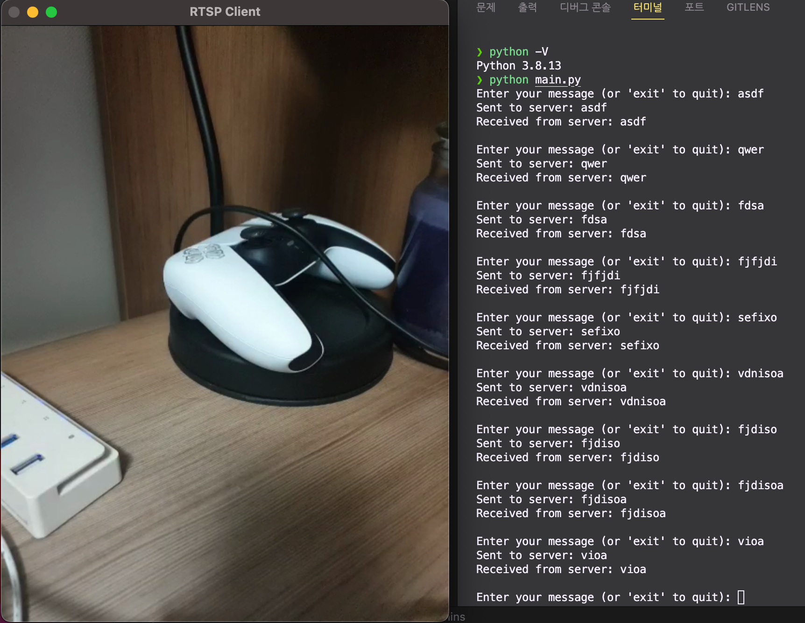

# android-rtsp-server
Android RTSP 서버 어플리케이션

[python-rtsp-client](https://github.com/alsrb968/python-rtsp-client)

## 동작 화면

  
  
  <figcaption align="center">실행 화면 (좌: 안드로이드 서버, 우: PC 클라이언트)</figcaption>

